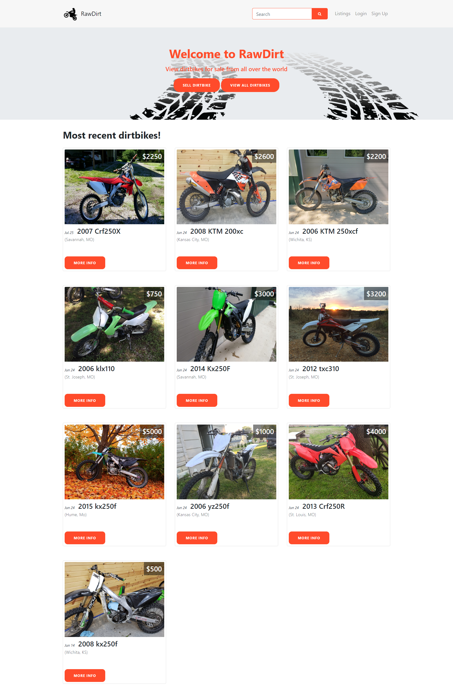

# RawDirt
Web application for the buying and selling of offroad machines like dirtbikes

The live version can be found at http://www.therawdirt.com/



## Has the following features:
- Display offroad listings from database
- CRUD operations for both the offroad listings and user profiles
- Search for offroad listings
- Users can create a favorites list of offroad listing
- Create an account (login and signup)
- User authenication
- Hosted on Heroku
- Built using Bootstrap, Node.js, Express, MongoDB, Mongoose
- Responsive Web Design

## To use the application: 

1. Clone to your local machine

2. Go to the folder in the terminal

3. Install the dependencies in package.json
```
npm install
```
4. Run the app
```
node app.js
```
5. Go to http://localhost:3000/ in browser to see the application
